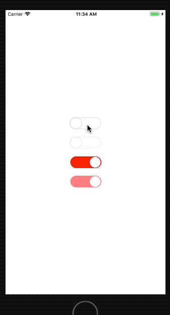

# react-native-sf-switch


# switch





# 安装
npm install react-native-sf-switch

# Props
|  parameter  |  type  |  required  |   description  |  default  |
|:-----|:-----|:-----|:-----|:-----|
|width|number|no|宽度|80|
|height|number|no|高度|30|
|checked|bool|no|是否选中|false|
|disabled|bool|no|是否不可修改|0|
|duration|number|no|动画时间（单位毫秒）|300'|
|borderColor|string|no|边框颜色|'rgba(233,233,233,1)'|
|disabledOpacity|number|no|不可修改时的透明度(0.0-1.0)|0.5|
|containerColor|string|no|背景颜色|'red'|
|containerStyle|object|no|容器样式（主要设置位置相关）|null|
|onChange|func|no|change 事件触发的回调函数|null|
|tag|func|number|标示|0|


# 例子
```

import React, { Component } from 'react';
import {
  Platform,
  StyleSheet,
  Text,
  View
} from 'react-native';
import SFSwitch from "react-native-sf-switch"

export default class App extends Component {
  render() {
    return (
      <View style={styles.container}>
        <SFSwitch/>
        <SFSwitch disabled={true} containerStyle={{
          marginTop:20
        }}/>
        <SFSwitch containerStyle={{
          marginTop:20
        }} checked={true}/>
        <SFSwitch containerStyle={{
          marginTop:20
        }} checked={true} disabled={true}/>
      </View>
    );
  }
}

const styles = StyleSheet.create({
  container: {
    flex: 1,
    justifyContent: 'center',
    alignItems: 'center',
  }
});

```